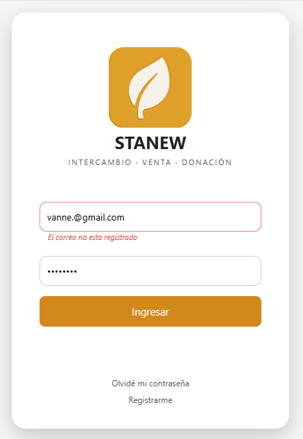
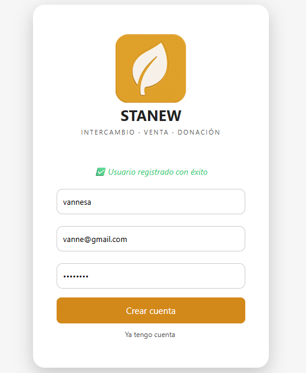
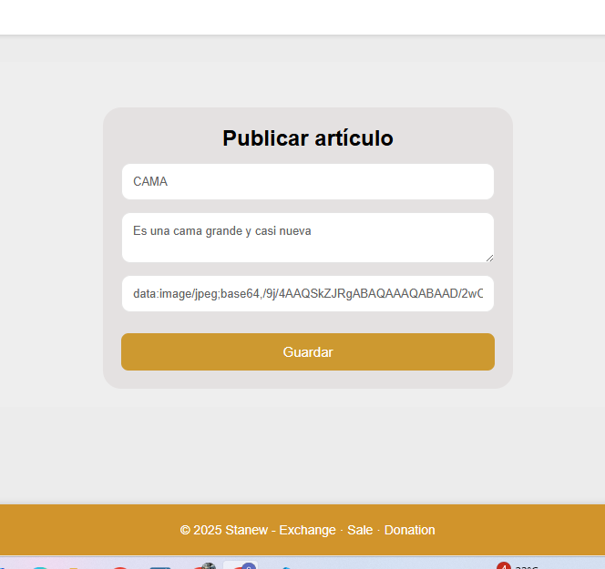
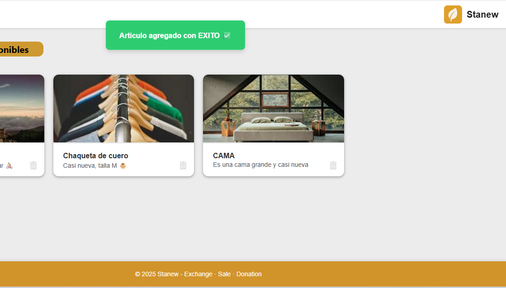

# Login y Gestión de Artículos (Node.js + React)

Este es un proyecto de práctica donde implementé un **sistema de login y registro de usuarios**, junto con un **CRUD de artículos**.  
El objetivo es aprender y mejorar mis habilidades con **Node.js, Express, MongoDB y React**.

---

## 🚀 Tecnologías
- **Backend:** Node.js, Express, MongoDB, JWT, bcrypt
- **Frontend:** React, CSS Modules
- **Otros:** Git, GitHub

---

## ✨ Funcionalidades
- Registro y login de usuarios con validación
- Autenticación con tokens JWT
- Gestión de artículos:
  - Crear un artículo
  - Ver listado de artículos
  - Editar artículo existente
  - Eliminar artículo
- Interfaz en React para manejar formularios y vistas

---

## 📸 Vista previa

### 🔑 Login y Registro
| Error en login | Registro correcto |
|----------------|----------------|
|  |  |

### 📦 Gestión de Artículos (CRUD)
| Formulario crear/editar | Vista de artículos |
|--------------------|--------------------------|
|  |  |

---

## ⚙️ Cómo ejecutar el proyecto

### 1. Clonar el repositorio
```bash
git clone https://github.com/sharon-Rodriguez/FRONTEND-BACKEND-login-y-gestion-articulos.git
cd FRONTEND-BACKEND-login-y-gestion-articulos
```

### 2. Backend
```bash
cd Backend-node.js
npm install
npm start
```

### 1. Clonar el repositorio
```bash
cd Frontend-react
npm install
npm start
```
# Autor
Sharon Vannesa Rodriguez Medina
